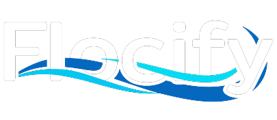
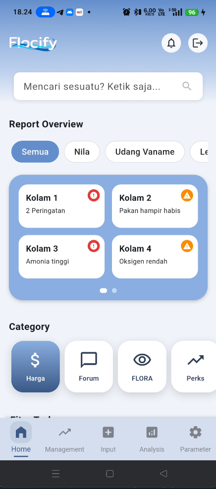
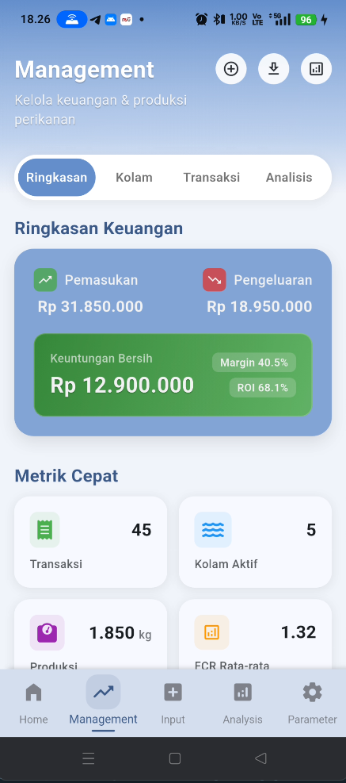

# proyek_flocify

A new Flutter project.

## Getting Started

This project is a starting point for a Flutter application.

A few resources to get you started if this is your first Flutter project:

- [Lab: Write your first Flutter app](https://docs.flutter.dev/get-started/codelab)
- [Cookbook: Useful Flutter samples](https://docs.flutter.dev/cookbook)

For help getting started with Flutter development, view the
[online documentation](https://docs.flutter.dev/), which offers tutorials,
samples, guidance on mobile development, and a full API reference.

---
---
---

# Flocify App 🐟

 Aplikasi mobile manajemen budidaya perikanan cerdas berbasis Flutter, dirancang untuk membantu peternak modern meningkatkan produktivitas dan profitabilitas melalui monitoring real-time dan manajemen data terpusat.

---

## ✨ Fitur Utama

-   **Onboarding & Aktivasi Alat:** Alur pendaftaran pengguna baru yang mulus dengan aktivasi alat Flocify melalui pemindaian QR code.
-   **Dashboard Home:** Tampilan ringkasan status semua kolam secara *real-time*, berita terkini, dan akses cepat ke fitur-fitur utama.
-   **Manajemen Komprehensif:** Modul terpusat untuk memantau detail keuangan (pemasukan, pengeluaran, profit) dan metrik produksi (populasi, FCR, ROI) per kolam.
-   **Arsitektur Profesional:** Dibangun di atas arsitektur *Feature-Driven* yang bersih dan skalabel, memisahkan lapisan *Presentation*, *Domain*, dan *Data*.
-   **State Management Modern:** Menggunakan Riverpod untuk manajemen state yang reaktif, prediktif, dan efisien.

---

## 📸 Screenshot Aplikasi

| Halaman Home                               | Halaman Manajemen                    |  
| ------------------------------------------ | ------------------------------------ | ------------------------------------ |
|  |  |

---

## 🛠️ Teknologi & Arsitektur

Aplikasi ini dibangun dengan mengedepankan kualitas kode, skalabilitas, dan kemudahan pemeliharaan.

-   **Framework:** Flutter 3.x
-   **Bahasa:** Dart
-   **Arsitektur:** Feature-Driven Clean Architecture
    -   **Data:** Lapisan yang bertanggung jawab untuk mengambil data dari sumber eksternal (Firebase, API).
    -   **Domain:** Lapisan inti yang berisi model data dan logika bisnis murni (*Use Cases*), tidak bergantung pada framework.
    -   **Presentation:** Lapisan UI dan *state management*, menghubungkan logika ke tampilan menggunakan Riverpod.
-   **State Management:** Flutter Riverpod
-   **Backend & Database:** Firebase (Authentication, Firestore, dll.)
-   **Fitur Tambahan:**
    -   `mobile_scanner` untuk pemindaian QR Code.
    -   `intl` untuk format data (mata uang, tanggal).

---

## 🚀 Memulai (Getting Started)

Untuk menjalankan proyek ini di mesin lokal Anda, ikuti langkah-langkah berikut:

1.  **Prasyarat:**
    -   Pastikan Anda sudah menginstal [Flutter SDK](https://flutter.dev/docs/get-started/install).
    -   Sebuah editor kode seperti VS Code atau Android Studio.

2.  **Clone Repositori:**
    ```bash
    git clone [https://github.com/](https://github.com/)[NAMA_PENGGUNA_ANDA]/flocify-app.git
    cd flocify-app
    ```

3.  **Setup Firebase:**
    -   Buat proyek baru di [Firebase Console](https://console.firebase.google.com/).
    -   Ikuti instruksi untuk menambahkan aplikasi Android dan/atau iOS ke proyek Firebase Anda.
    -   Unduh file konfigurasi (`google-services.json` untuk Android, `GoogleService-Info.plist` untuk iOS) dan letakkan di direktori yang sesuai.
    -   Gunakan [FlutterFire CLI](https://firebase.flutter.dev/docs/cli) untuk men-generate file `lib/firebase_options.dart` Anda sendiri.
      ```bash
      flutterfire configure
      ```

4.  **Instal Dependencies:**
    ```bash
    flutter pub get
    ```

5.  **Jalankan Aplikasi:**
    ```bash
    flutter run
    ```

---

Dibuat dengan ❤️ oleh **[Nama Anda]**.